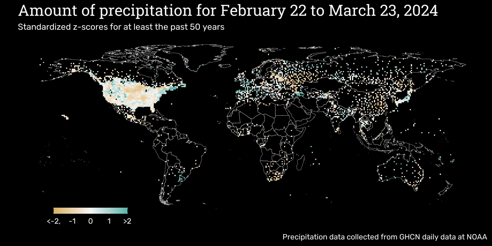

<link rel="preconnect" href="https://fonts.googleapis.com">
<link rel="preconnect" href="https://fonts.gstatic.com" crossorigin>
<link href="https://fonts.googleapis.com/css2?family=Patua+One&family=Rubik&display=swap" rel="stylesheet">

```{css echo = FALSE}
.main-container {
    max-width: 100%;
}
```



Last updated on `r lubridate::today()`.  
Site [developed](`r rmarkdown::metadata$github_repo`) by [Paul Villanueva](mailto:`r rmarkdown::metadata$email_address`).